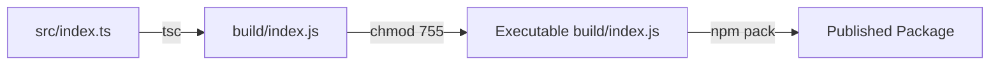
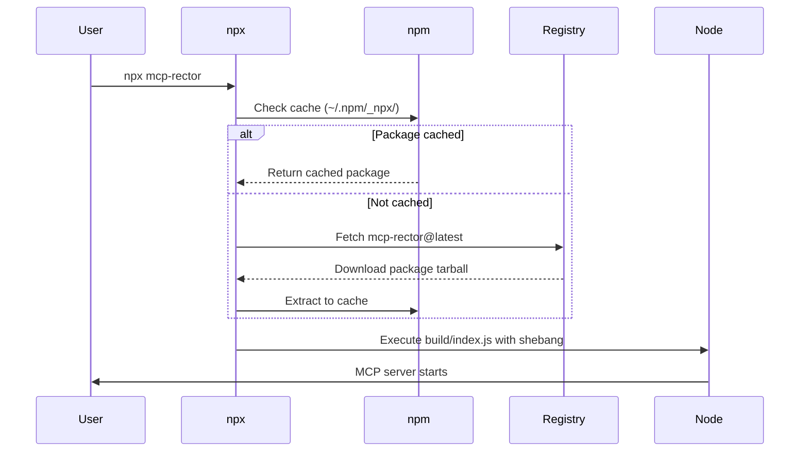
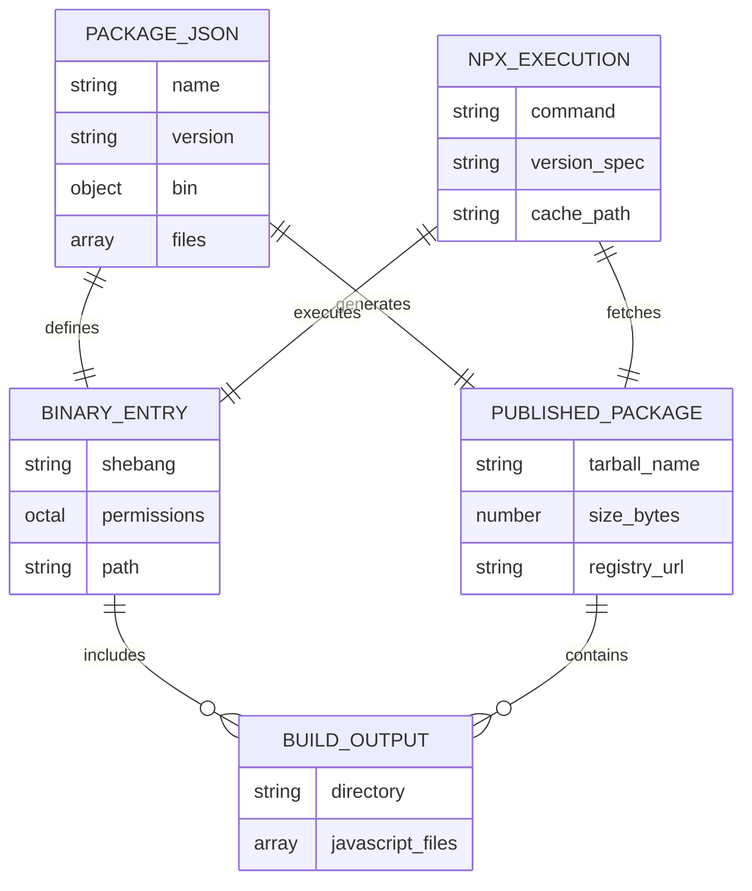

# Data Model: NPX Execution Support

**Feature**: 002-npx-support  
**Date**: 2025-10-23  
**Purpose**: Define package configuration entities and their relationships

## Overview

This feature is configuration-based, not data-driven. The "data model" consists of metadata structures in package.json and file system artifacts required for npm publishing and npx execution.

## Entity: NPM Package Metadata

**Source**: `package.json` (repository root)

### Fields

| Field | Type | Required | Description | Example |
|-------|------|----------|-------------|---------|
| name | string | Yes | Package identifier on npm registry | "mcp-rector" |
| version | string (semver) | Yes | Semantic version number | "1.0.0" |
| description | string | Yes | Short package summary for npm search | "Model Context Protocol server for querying Rector PHP refactoring rules" |
| keywords | string[] | Yes | Tags for npm search discoverability | ["mcp", "rector", "php", "refactoring"] |
| author | string | Yes | Package maintainer | "Name <email@example.com>" |
| license | string | Yes | SPDX license identifier | "ISC" |
| main | string | Yes | Entry point for require() | "index.js" |
| bin | Record<string, string> | Yes | Executable command mappings | {"mcp-rector": "./build/index.js"} |
| files | string[] | Yes | Included files/dirs in published package | ["build"] |
| type | string | Yes | Module system type | "module" |
| repository | object | Recommended | Git repository information | {"type": "git", "url": "..."} |
| homepage | string | Recommended | Project homepage URL | "https://github.com/..." |
| bugs | object | Recommended | Issue tracker URL | {"url": "..."} |
| scripts | object | Yes | Build and test commands | {"build": "tsc && chmod 755 ..."} |
| dependencies | object | Yes | Runtime dependencies | {"@modelcontextprotocol/sdk": "^1.20.1"} |
| devDependencies | object | Yes | Development dependencies | {"typescript": "^5.9.3"} |

### Validation Rules

- **name**: Must be lowercase, URL-safe, available on npm registry
- **version**: Must follow semantic versioning (MAJOR.MINOR.PATCH)
- **bin**: Paths must exist in published package, must be executable
- **files**: Must include all runtime-required directories
- **main**: Must point to valid JavaScript entry point
- **type**: Must be "module" for ES modules
- **scripts.build**: Must compile TypeScript and set executable permissions

### Current State vs Required State

**Current (`package.json`)**:
```json
{
  "name": "mcp-rector",
  "type": "module",
  "version": "1.0.0",
  "main": "index.js",
  "bin": {
    "weather": "./build/index.js"  // WRONG: leftover from template
  },
  "scripts": {
    "build": "tsc && chmod 755 build/index.js"  // CORRECT ✅
  },
  "files": ["build"],  // CORRECT ✅
  "keywords": [],  // MISSING
  "author": "",  // MISSING
  "license": "ISC",  // CORRECT ✅
  "description": ""  // MISSING
}
```

**Required Changes**:
1. Fix `bin.weather` → `bin.mcp-rector`
2. Add meaningful `description`
3. Add `keywords` array with relevant tags
4. Set `author` field
5. Add `repository`, `homepage`, `bugs` fields

---

## Entity: Binary Entry Point

**Source**: `build/index.js` (compiled from `src/index.ts`)

### Attributes

| Attribute | Type | Required | Description | Validation |
|-----------|------|----------|-------------|------------|
| shebang | string | Yes | Interpreter directive | Must be `#!/usr/bin/env node` |
| permissions | octal | Yes | Unix file permissions | Must be `755` (-rwxr-xr-x) |
| content | JavaScript | Yes | Compiled TypeScript code | Must be valid Node.js code |

### File Structure

```javascript
#!/usr/bin/env node
// ^ Shebang must be first line

// Compiled TypeScript code follows
import { Server } from "@modelcontextprotocol/sdk/server/index.js";
// ... rest of application code
```

### Validation Rules

- **Shebang**: Must be exact string `#!/usr/bin/env node` on line 1
- **Permissions**: File must be executable (`chmod 755`)
- **Syntax**: Must pass Node.js syntax validation
- **Dependencies**: All imports must resolve in published package

### Build Process



**Steps**:
1. TypeScript compiler reads `src/index.ts`
2. Compiler outputs `build/index.js` (preserves shebang if present in source)
3. Build script runs `chmod 755 build/index.js`
4. npm includes `build/index.js` when publishing (via `files` field)

---

## Entity: Published Package Structure

**Artifact**: Generated by `npm pack` and uploaded to npm registry

### Directory Layout

```
mcp-rector-1.0.0.tgz (npm package)
└── package/
    ├── package.json        # Metadata (auto-included by npm)
    ├── README.md           # Documentation (auto-included by npm)
    ├── LICENSE             # License file (auto-included if present)
    └── build/              # Compiled application (from files field)
        ├── index.js        # Entry point (executable, with shebang)
        ├── models/         # Compiled models
        ├── services/       # Compiled services
        └── tools/          # Compiled tools
```

### Inclusion Rules

**Automatically Included** (npm defaults):
- `package.json`
- `README.md`
- `LICENSE` or `LICENSE.*`

**Explicitly Included** (via `files` field):
- `build/` directory and all contents

**Automatically Excluded** (npm defaults):
- `node_modules/`
- `.git/`
- `*.swp`, `._*`, `.DS_Store`
- `.npmrc`
- `.gitignore`

**Excluded by Design** (not in `files` field):
- `src/` - TypeScript source (users don't need)
- `specs/` - Feature specifications (documentation only)
- `tests/` - Test files (not needed at runtime)
- `.specify/` - Spec-driven development tooling
- `tsconfig.json` - Build configuration (not needed at runtime)

### Size Constraints

- **Target**: <5MB total package size
- **Estimated**: <1MB (TypeScript output + dependencies are lightweight)
- **Verification**: Run `npm pack --dry-run` to preview size

---

## Entity: npx Execution Flow

**Purpose**: Document how npx resolves and executes the package

### Execution Sequence



### Platform-Specific Behavior

#### Unix/Linux/macOS
1. npx reads shebang from `build/index.js`
2. Executes `/usr/bin/env node build/index.js`
3. Node.js runtime starts MCP server

#### Windows
1. npm creates wrapper scripts during installation:
   - `mcp-rector.cmd` (for cmd.exe)
   - `mcp-rector.ps1` (for PowerShell)
2. npx executes appropriate wrapper
3. Wrapper invokes `node build/index.js`
4. Node.js runtime starts MCP server

**Note**: Shebang is ignored on Windows but required for Unix systems.

---

## Entity: Version Resolution

**Purpose**: Define how npx handles version specifications

### Version Syntax

| User Command | Resolution | Use Case |
|--------------|-----------|----------|
| `npx mcp-rector` | Latest version from npm registry | Development, testing latest features |
| `npx mcp-rector@1.0.0` | Exact version 1.0.0 | Reproducible environments, CI/CD |
| `npx mcp-rector@^1.0.0` | Latest 1.x.x version | Compatible updates, patch/minor only |
| `npx mcp-rector@1.x` | Latest 1.x.x version | Semantic version range |

### Cache Behavior

- **Location**: `~/.npm/_npx/<hash>/node_modules/mcp-rector`
- **Lifetime**: Persistent until manual deletion
- **Updates**: npx checks for newer versions on each run
- **Offline**: Uses cache if registry unreachable

---

## Relationships



---

## Validation Checklist

### Pre-Publish Validation

- [ ] `package.json` has correct `bin.mcp-rector` field
- [ ] `src/index.ts` has shebang as first line
- [ ] `build/index.js` has shebang after compilation
- [ ] `build/index.js` has 755 permissions
- [ ] `package.json` has non-empty `description`
- [ ] `package.json` has meaningful `keywords`
- [ ] `package.json` has `author` set
- [ ] `package.json` has `repository`, `homepage`, `bugs` fields
- [ ] `npm pack --dry-run` shows only build/ directory
- [ ] Package size is <5MB
- [ ] All TypeScript compiles without errors
- [ ] All tests pass

### Post-Publish Validation

- [ ] `npm view mcp-rector` shows correct metadata
- [ ] `npx mcp-rector` executes successfully on Linux
- [ ] `npx mcp-rector` executes successfully on macOS
- [ ] `npx mcp-rector` executes successfully on Windows
- [ ] `npx mcp-rector@<version>` executes specific version
- [ ] MCP Inspector can connect to npx-launched server
- [ ] All Rector rule tools function correctly

---

## Migration Notes

**Current State**: Package has build configuration but incorrect `bin` field and missing metadata.

**Required Changes**:
1. Update `package.json` bin field from `weather` to `mcp-rector`
2. Add shebang to `src/index.ts`
3. Populate metadata fields (description, keywords, author, repository)
4. Verify build process preserves shebang and permissions
5. Test npx execution locally before publishing

**No Breaking Changes**: This feature only affects distribution, not functionality. Existing local installations continue working.
